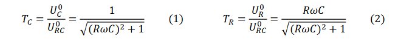
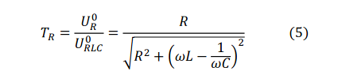
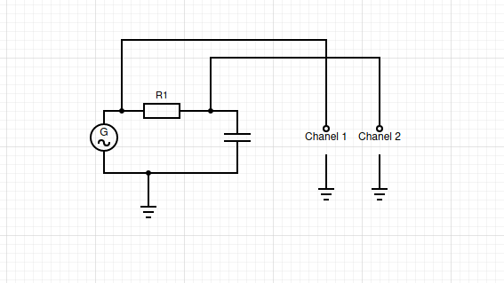
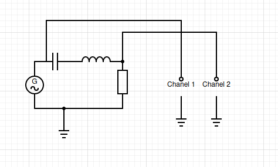
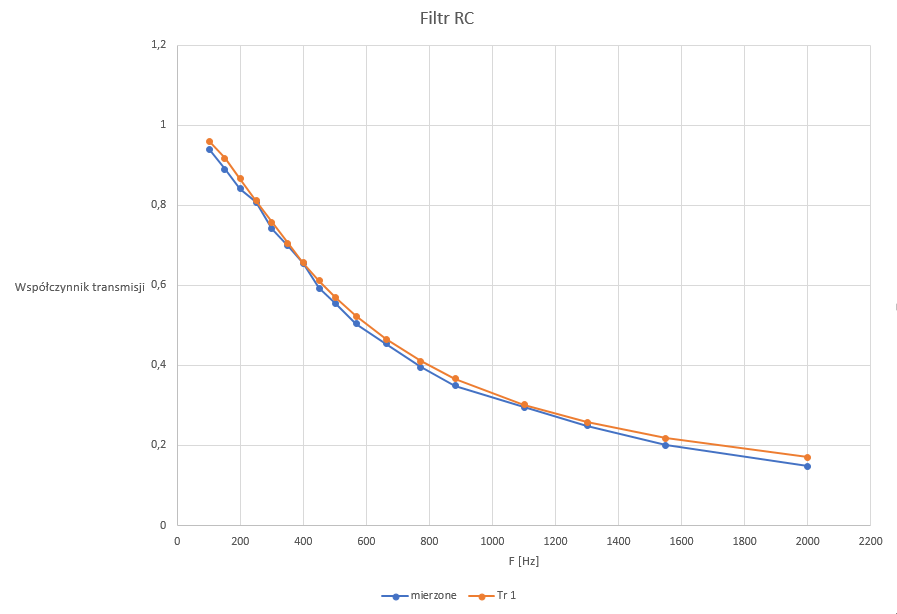
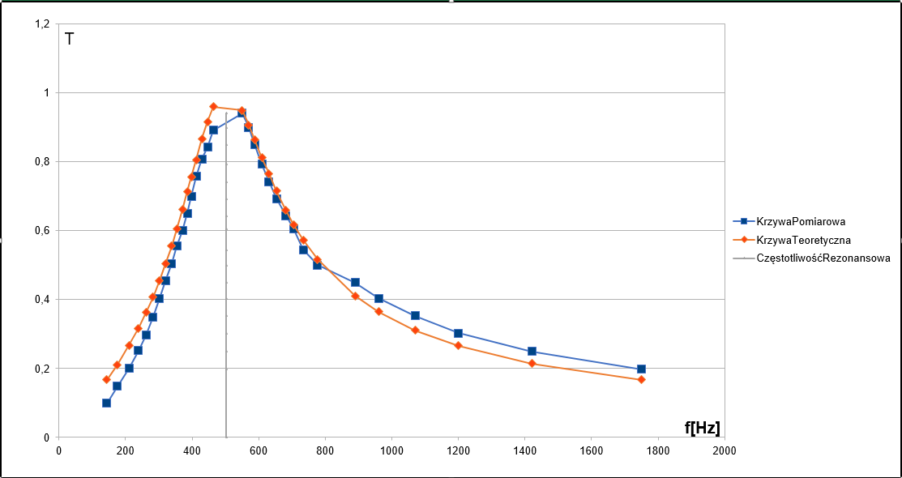

# Podstawa teoretyczna
Obwody RC i RL zasilane prądem zmiennym sinusoidalnie zachowują się jak filtry. Miarą przepuszczalności filtra jest współczynnik transmisji –stosunek  amplitudy napięcia wyjściowego do wejściowego.
## Obwod RC
### Zasada dzialania
W obwodzie RC wraz ze wzrostem częstotliwości sygnału wejściowego maleje impedancja kondensatora, a więc maleje także napięcie na kondensatorze.
Napięcie na oporniku jednakże rośnie, poniewaz ich suma musi być równa napięciu zasilania.
### Układy (dolno i górno przepustowy)
Traktując napiecie zasilania obwodu jako napięcie wejściowe,  oznaczone jako URC, zaś napięcie na kondensatorze UC jako wyjściowe, to tak skonstruowany układ przepuszcza dobrze sygnały o niskich częstotliwościach, a tłumi sygnały o wysokich - staje sie tym samym filtrem dolnoprzepustowym.
W sytuacji odwrotnej natomiast gdy napięcie  wyjściowe UR mierzymy na oporniku, to częstotliwości wysokie zostaja przepuszczone, a tłumione są te o niższej częstotliwości. Nasz układ zamienia sie w filtr górnoprzepustowy.
### wspolczynnik transmisji
Zależność współczynnika transmisji od częstotliwości dla obwodu RC wyraża się wzorem: 

## Obwod RLC
### Zasada działania i zastosowanie
Gdy zbudujemy szeregowy obwód RLC, impedancja kondensatora i cewki mają przeciwne znaki i odwrotnie zmieniają się wraz z częstotliwością. Przy częstotliwości sygnału wejsciowego rownej ω2=1/LC obie te impedancje anulują się i jedyny spadek napiecia zachodzi na oporniku. Taki stan nazywamy stanem rezonansu. Napięcie UR na oporniku jest maksymalne. Obwód taki zachowuje sie jak filtr rezonansowy nastawiony na jedną częstotliwość, pozostałe zaś są tłumione.

### Wspolczynnik transmisjii
Zależność współczynnika transmisji od częstotliwości dla obwodu RLC wyraża się wzorem: 

# Metody
Wspólczynnik transmisjii możemy zmierzyc używając oscyloskopu i generatora sygnału sinusoidalnego.
Kanał 1 oscyloskopu podłączamy do wejścia obwodu, kanał 2 natomiast do  wyjścia. Mierzymy nastepnie amplitudy tych sygnałów.
Łączymy je w następujacy sposób:
## RC:

## RLC:

# Analiza wynikow
## Zależność wspólczynnika transmisji od częstotliwości w układzie RC

Porównując zmierzone wartości z wartościami obliczonymi ze wzoru, otrzymujemy bardzo podobne krzywe. Ich różnice są spowodowane przez niedokładności pomiarowe oscyloskopu, niedokładności generatora sygnału oraz przez różne od nominalnych wartości elementów elektronicznych.
Udawadnia to działanie obwodu RC jako filtra dolnoprzepustowego, który przepuszcza sygnały o niskiej częstotliwości, a te o wyższej tłumi.
 

## Zależność wspólczynnika transmisji od częstotliwości w układzie RLC
W układzie RLC także zmierzone wartości i wartości obliczone ze wzoru są podobne. Różnice są spowodowane przez niedokładności pomiarowe oscyloskopu, niedokładności generatora sygnału oraz przez różne od nominalnych wartości elementów elektronicznych.
Udawadnia to działanie obwodu RLC jako filtra wszystkich oprócz jednej częstotliwości. 

