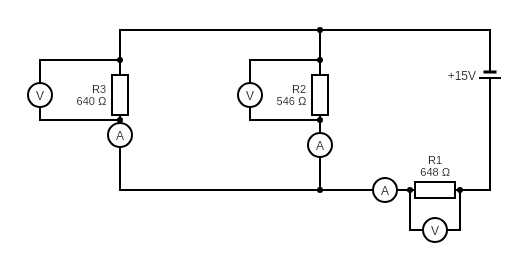

# Zadanie 2

## Prawa kirchoffa

1. Suma natężeo prądów wpływających do węzła obwodu elektrycznego jest równa sumie natężeo prądów wypływających z tego węzła.
2. Suma spadków potencjału na wszystkich elementach oczka obwodu jest równa sumie sił elektromotorycznych znajdujących się w tym oczku.

## Metody

zeby sprawdzic zasadnsc praw kirhcofa zbudujemy prosty uklad skladajacy sie z 2 oczek pradu stalego przedstawiony na poniższej grafice  nastepnie obliczymy natezenia i spadki napiecia na poszczegolnych elementach ktore potem sprawdzimy wykonujac pomiary miernikiem uniwersalnym


## Doswiadczenie

### Liczymy natężenia i spadki napiecia na poszczególnych elementach

* Zapisujemy równania oczek prądu
```	
	Rc = R1 + 1/(1/R2 + 1/R3)

	Ir1 = E / Rc
	
	Ur1 = Ir1 * R1
	
	Ir1 = Ir2 + Ir3

	Ir2 = Ur1 / R3
	Ir3 = Ur1 / R2

	Ur2 = Ir2 * R2
	Ur3 = Ir3 * R3
```
* Podstawiamy wartości
```
	Rc = 648Ω + 266.28Ω = 914Ω 

	Ir1 = 15.01V / 914Ω 
	Ir1 = 0.02A 

	Ur1 = 0.02A * 648Ω 
	Ur1 = 10.63V 

	Ir2 = 4.37V / 640Ω 
	Ir2 = 0.007A 

	Ur2 = 0.007A * 456Ω 
	Ur2 = 3,192V 

	Ir3 = 4.37V / 456Ω 
	Ir3 = 0.01A 

	Ur3 = 0.01A * 640Ω 
	Ur3 = 6,4V 	
```
* Porownujemy z doswiadczeniem

## Analiza błedow

Różnice pomiędzy wartościami idealnymi a zmierzonymi wynikaja z wielu czynników między innymi

* Niedokładności wynikające z błędow pomiarowych miernika
* Rożnica pomiedzy faktyczną a nominalną rezystancją oporników
* Błedy pomiaru spowodowane wpływem nie idealnie nieskończonego oporu voltomierzy na pomiary nateżenia
* Wystepuje takze efekt nakładania się kolejnych błędów pomiarowych	
